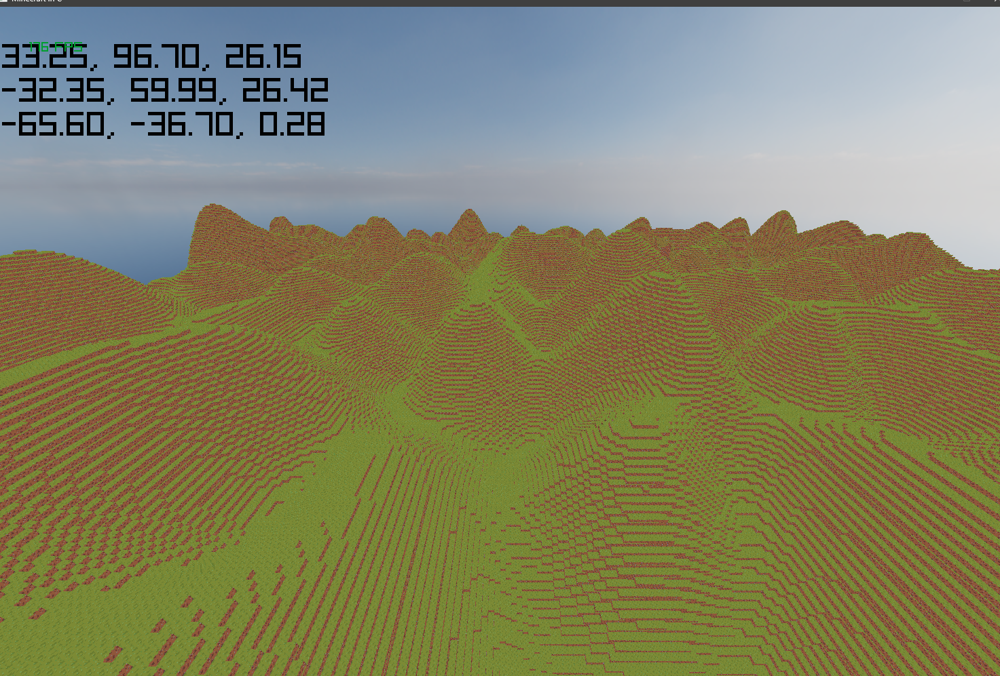

# MinecraftInC
A Minecraft clone in C using Raylib

This is a continuation of the [MinecraftClone](https://github.com/FlurinBruehwiler/MinecraftClone) project, where I created a simple Minecraft clone in C# using Raylib. This project is basically the same, but done in C and with hopefully a few more features.

Goals:
- Block face culling
- Basic terrain generation
- Basic building
- Glass Blocks
- Water rendering :)
- Player controller
- Shader based ambient occlusion
- Multiplayer

## Screenshots

## Build & Run
TODO
